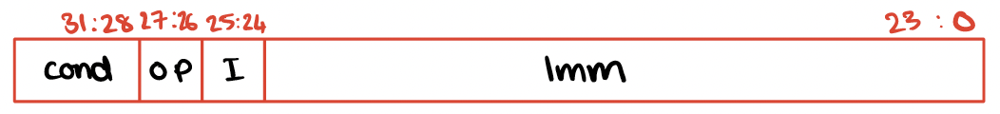
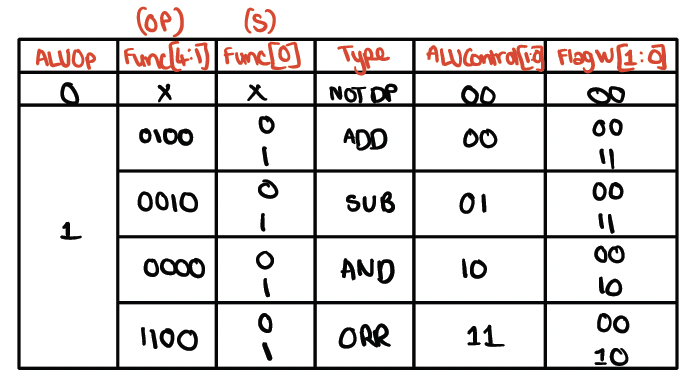

# CPU_Design

## Overview
This project implements a Reduced Instruction Set Computer (RISC)-based CPU using Verilog HDL. The CPU is designed to execute a basic set of instructions categorized into Data Processing, Memory Operations, and Branching. It supports conditional execution as defined by the ARM Architecture Reference Manual (ARM LRM).

---

## Features
The CPU supports the following operations:

### Data Processing
1. **ADD** - Add two registers or a register and an immediate value.
2. **SUB** - Subtract one register or an immediate value from another.
3. **AND** - Perform a bitwise AND operation.
4. **ORR** - Perform a bitwise OR operation.

### Memory Operations
1. **STR** - Store data from a register into memory.
2. **LDR** - Load data from memory into a register.

### Branching
1. **B** - Branch to a specified address, supporting conditional execution.

### Conditional Mnemonics
The CPU handles all conditional mnemonics specified in the ARM LRM, including but not limited to:
- **EQ**: Equal
- **NE**: Not Equal
- **GT**: Greater Than
- **LT**: Less Than
- **GE**: Greater Than or Equal
- **LE**: Less Than or Equal
- **AL**: Always (unconditional execution)

---

## Architecture
  
  
### Datapath

#### Branch Instruction
  

#### Data Processing with Immediate Values
  

#### Data Processing
  

#### Load Instruction (LDR)
  

#### Store Instruction (STR)
  

The CPU consists of a carefully designed datapath to handle the instruction execution process. Key components include:
- **Instruction Memory**: Stores instructions for execution.
- **Data Memory**: Stores data values used by the CPU.
- **General-Purpose Registers**: A register file for temporary storage.
- **ALU**: Performs arithmetic and logical operations.
- **Controller**: Decodes instructions and generates control signals.

### Instruction Set
The instruction encoding follows the ARM LRM specification:
- **Data Processing Instructions**: Encoded with register and immediate value support.
  

- **Memory Instructions**: Support for pre-indexed and post-indexed addressing modes.
  

- **Branch Instructions**: Conditional and unconditional branching.
  
  
  

---

### Control
The control logic for the CPU has been detailed to show how signals are routed to different components. Below is an image of the controller logic
  

#### Control Signals to Datapath
  

#### ALU Control Logic
  

---

## Simulation
To verify the functionality of the CPU, follow these steps:

1. **Open a Verilog Simulation Tool:**
   Use ModelSim or any other compatible Verilog simulation tool.

2. **Compile Verilog Files:**
   Compile all the Verilog files provided in the repository.

3. **Load the Testbench:**
   Load the `design.sv` testbench into the simulator.

4. **Run the Simulation:**
   Simulate the design and inspect the waveform or log output to validate the CPU's behavior.

---

## Future Enhancements
Here are some ideas for extending the capabilities of the CPU:

1. **Pipeline Implementation:**
   Introduce pipelining to increase the CPU's throughput by overlapping instruction execution.

2. **Interrupt Handling:**
   Add support for interrupts to handle asynchronous events.

3. **Floating-Point Operations:**
   Extend the ALU to perform floating-point arithmetic for more complex computations.

