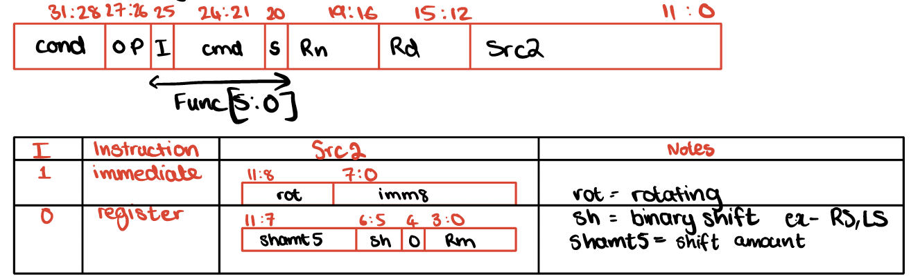
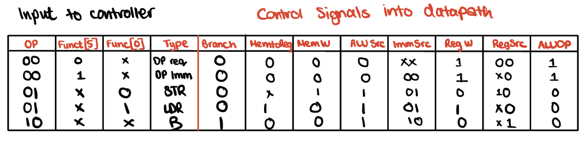

# CPU_Design

## Overview
This project implements a Reduced Instruction Set Computer (RISC)-based CPU using Verilog HDL. The CPU is designed to execute a basic set of instructions categorized into Data Processing, Memory Operations, and Branching. It supports conditional execution as defined by the ARM Architecture Reference Manual (ARM LRM).

---

## Features
The CPU supports the following operations:

### Data Processing
1. **ADD** - Add two registers or a register and an immediate value.
2. **SUB** - Subtract one register or an immediate value from another.
3. **AND** - Perform a bitwise AND operation.
4. **ORR** - Perform a bitwise OR operation.

### Memory Operations
1. **STR** - Store data from a register into memory.
2. **LDR** - Load data from memory into a register.

### Branching
1. **B** - Branch to a specified address, supporting conditional execution.

### Conditional Mnemonics
The CPU handles all conditional mnemonics specified in the ARM LRM, including but not limited to:
- **EQ**: Equal
- **NE**: Not Equal
- **GT**: Greater Than
- **LT**: Less Than
- **GE**: Greater Than or Equal
- **LE**: Less Than or Equal
- **AL**: Always (unconditional execution)

---

## Architecture
  
  
### Datapath

Below is an image of the detailed datapath for each instruction. The red wires highlight the paths and control signals used for each specific instruction:

#### Branch Instruction
  

#### Data Processing with Immediate Values
  

#### Data Processing
  

#### Load Instruction (LDR)
  

#### Store Instruction (STR)
  

The CPU consists of a carefully designed datapath to handle the instruction execution process. Key components include:
- **Instruction Memory**: Stores instructions for execution.
- **Data Memory**: Stores data values used by the CPU.
- **General-Purpose Registers**: A register file for temporary storage.
- **ALU**: Performs arithmetic and logical operations.
- **Controller**: Decodes instructions and generates control signals.

### Instruction Set
The instruction encoding follows the ARM LRM specification:
- **Data Processing Instructions**: Encoded with register and immediate value support.
  

- **Memory Instructions**: Support for pre-indexed and post-indexed addressing modes.
  

- **Branch Instructions**: Conditional and unconditional branching.
  
  
  

---

### Control
The control logic for the CPU has been detailed to show how signals are routed to different components. Below is an image of the controller logic
  

#### Control Signals to Datapath
  

#### ALU Control Logic
  

---

## Simulation
To verify the functionality of the CPU, follow these steps:

1. **Open a Verilog Simulation Tool:**
   Use ModelSim or any other compatible Verilog simulation tool.

2. **Compile Verilog Files:**
   Compile all the Verilog files provided in the repository.

3. **Load the Testbench:**
   Load the `design.sv` testbench into the simulator.

4. **Run the Simulation:**
   Simulate the design and inspect the waveform or log output to validate the CPU's behavior.

---
## Testing

To verify the functionality of the CPU, I referenced the test code provided in Digital Design and Computer Architecture ARM Edition by Harris that is shown in the table below. The correctness of the design has been proven through simulation. By the end of execution, the value 7 must be stored at memory address 84 (index 21 in the memory array). This would validate the functionality of:

#### Data Processing Instructions: 
Ensures correct ALU operations like addition, subtraction, AND, and ORR.

#### Memory Operations: 
Validates the correct implementation of LDR and STR instructions, ensuring proper interaction with the memory subsystem.

#### Branching: 
Confirms that conditional branch instructions work as expected, with the program counter updating correctly based on branch conditions.

| ADDR | PROGRAM             | COMMENTS                      | BINARY MACHINE CODE          | HEX CODE   |
|------|---------------------|-------------------------------|------------------------------|------------|
| 00   | SUB R0, R15, R15    | R0 = 0                        | 1110 0000 0010 1111 0000 0000 0000 1111 | E04F000F |
| 04   | ADD R2, R0, #5      | R2 = 5                        | 1110 0010 1000 0000 0010 0000 0000 0101 | E2802005 |
| 08   | ADD R3, R0, #12     | R3 = 12                       | 1110 0010 1000 0000 0011 0000 0000 1100 | E280300C |
| 0C   | SUB R7, R3, #9      | R7 = 3 - 9 = -6               | 1110 0010 0100 0011 0111 0000 0000 1001 | E2437009 |
| 10   | ORR R4, R7, R2      | R4 = 3 OR 5 = 7               | 1110 0001 1000 0111 0100 0000 0000 0010 | E1874002 |
| 14   | AND R3, R5, R4      | R5 = 4 AND 7 = 4              | 1110 0000 0000 0101 0100 0000 0000 0100 | E0035004 |
| 18   | ADD R5, R5, R4      | R5 = 4 + 7 = 11               | 1110 0000 1000 0101 0101 0000 0000 0100 | E0855004 |
| 1C   | SUBS R8, R5, R7     | R8 = 11 - 3 = 8, set Flags    | 1110 0001 0100 0101 1000 0000 0000 0111 | E0558007 |
| 20   | BEQ END             | shouldn’t be taken            | 0000 1010 0000 0000 0000 0000 0000 1100 | 0A00000C |
| 24   | SUBS R8, R3, R4     | R8 = 12 - 7 = 5               | 1110 0001 0100 0011 1000 0000 0000 0100 | E0538004 |
| 28   | BGE AROUND          | should be taken               | 1010 1010 0000 0000 0000 0000 0000 0000 | AA000000 |
| 2C   | ADD R5, R0, #0      | should be skipped             | 1110 0010 1000 0000 0101 0000 0000 0000 | E2805000 |
| 30   | AROUND SUBS R8, R7, R2 | R8 = 3 - 5 = -2, set Flags  | 1110 0001 0100 0111 1000 0000 0000 0010 | E0578002 |
| 34   | ADDLT R7, R5, #1    | R7 = 11 + 1 = 12              | 1011 0010 1000 0101 0111 0000 0000 0001 | B2857001 |
| 38   | SUB R7, R7, R2      | R7 = 12 - 5 = 7               | 1110 0100 0111 0111 0111 0000 0000 0010 | E0477002 |
| 3C   | STR R7, [R3, #84]   | mem[12+84] = 7                | 1110 0101 1000 0011 0111 0100 0101 0100 | E5837054 |
| 40   | LDR R2, [R0, #96]   | R2 = mem[96] = 7              | 1110 0101 1001 0000 0010 0110 0000 0000 | E5902060 |
| 44   | ADD R15, R15, R0    | PC = PC+8 (skips next)        | 1110 1000 1111 1111 0000 0000 0000 0000 | E08FF000 |
| 48   | ADD R2, R0, #14     | shouldn’t happen              | 1110 0010 1000 0000 0010 0000 0000 1110 | E280200E |
| 4C   | B END               | always taken                  | 1110 1010 0000 0000 0000 0000 0000 0001 | EA000001 |
| 50   | ADD R2, R0, #13     | shouldn’t happen              | 1110 0010 1000 0000 0010 0000 0000 1101 | E280200D |
| 54   | ADD R2, R0, #10     | shouldn’t happen              | 1110 0010 1000 0000 0010 0000 0000 1010 | E280200A |
| 58   | STR R2, [R0, #84]   | mem[84] = 7                   | 1110 0101 1000 0000 0010 0101 0100 0000 | E5802054 |

Below, the final output of mem[84] = 7 demonstrates that the CPU design executes the test program successfully and adheres to the expected behavior.

  

---

## Future Enhancements
Here are some ideas for extending the capabilities of the CPU:

1. **Pipeline Implementation:**
   Introduce pipelining to increase the CPU's throughput by overlapping instruction execution.

2. **Interrupt Handling:**
   Add support for interrupts to handle asynchronous events.

3. **Floating-Point Operations:**
   Extend the ALU to perform floating-point arithmetic for more complex computations.

